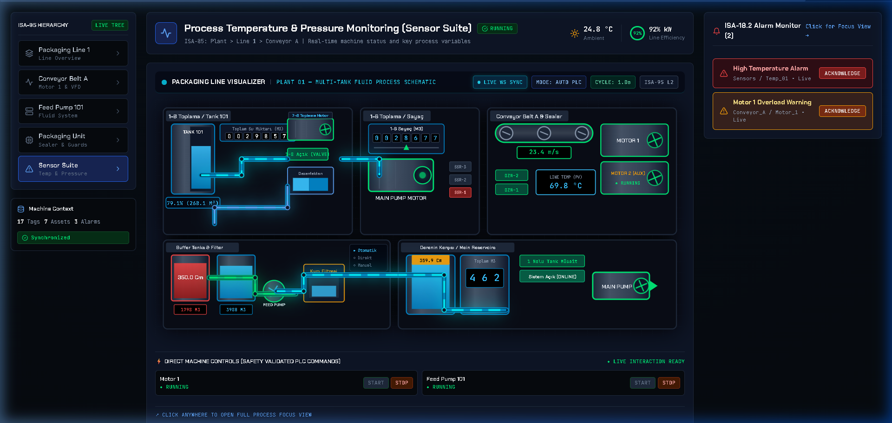
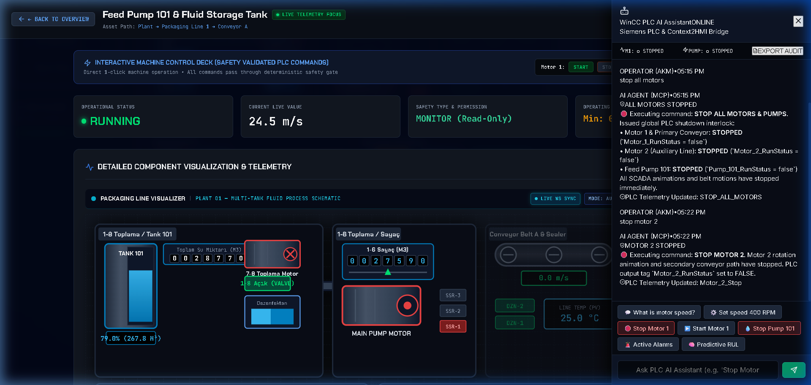
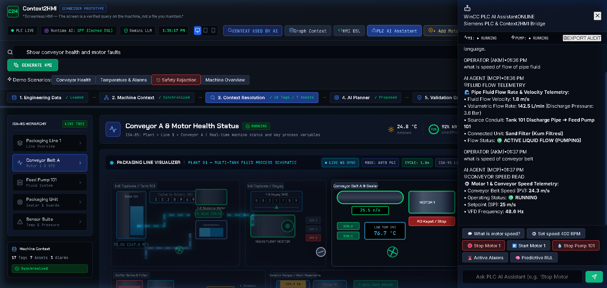

# 🏭 Screenless HMI for Industrial Automation (Context2HMI)

> **"The screen is a verified query on the machine, not a static file you maintain."**

[](LICENSE)
[](https://www.python.org/)
[](https://fastapi.tiangolo.com/)
[](https://react.dev/)
[](https://www.isa.org/)

**Screenless HMI (Context2HMI)** is an AI-driven, deterministic dynamic runtime HMI architecture engineered for next-generation Schneider Electric industrial automation. It eliminates the need for manual SCADA screen engineering by dynamically compiling safety-validated, context-aware graphical interfaces and executing machine control commands directly from natural language prompts and live machine state graph models.

---

## 📸 Output & Dashboard Showcase

### 1. High-Clarity Industrial SCADA HMI Process Visualizer
Real-time animated liquid process flow, ISA-95 Asset Hierarchy tree navigation, digital rolling counters, SSR indicators, and live alarm monitors.



---

### 2. ISA-95 Asset Focus View & Operational Telemetry
Clicking any asset in the ISA-95 tree or schematic immediately isolates the device into a dedicated Focus View with real-time process trends, setpoint controls, and direct PLC command execution buttons.



---

### 3. AI Assistant Context-Aware Machine Telemetry & Control
Natural language querying allows operators to ask machine status questions (e.g., *"What is the conveyor speed?"*, *"What is the speed of fluid flow?"*) and issue safety-validated commands (*"Stop all motors"*) with instant execution and live voice-ready telemetry.



---

## 🎯 Architectural Concept

```
   ENGINEERING ARTIFACTS (tags.json, io.json, alarms.json, asset_hierarchy.json)
                       │
                       ▼
             MACHINE CONTEXT GRAPH (ISA-95 Unified Model)
                       │
         ┌─────────────┴─────────────┐
         ▼                           ▼
  OPERATOR PROMPT           LIVE MACHINE STATE
         │                           │
         └─────────────┬─────────────┘
                       ▼
         DETERMINISTIC ENTITY RESOLVER
                       │
                       ▼
           AI SCREEN PLANNER (Gemini / Local Fallback)
                       │
                       ▼
            HMI DSL (JSON Specification)
                       │
                       ▼
         DETERMINISTIC VALIDATION GATE ◄── (11 SAFETY RULES CHECK)
          /                         \
    APPROVED                       REJECTED
       │                              │
  HMI RENDERER                  REJECTION VIEW
       │                     ("AI Proposed It. Validator Blocked It.")
       ▼
   LIVE DYNAMIC RUNTIME HMI
```

### 🛡️ The Central Safety Motto
> **AI PROPOSES. DETERMINISTIC VALIDATOR DECIDES. RUNTIME RENDERS APPROVED JSON.**

The LLM **NEVER** directly controls a machine and **NEVER** generates executable UI code directly. The runtime strictly renders JSON specifications that pass **all 11 deterministic safety rules**.

---

## ✨ Key Features

1. **ISA-95 Unified Machine Context Graph**:
   - Built dynamically on backend startup from engineering JSON artifacts (`tags.json`, `io.json`, `alarms.json`, `asset_hierarchy.json`, `comms.json`, `docs.json`).
   - Represents complex ISA-95 asset relationships, sensor tags, IO bindings, and alarms using a NetworkX directed graph.

2. **Deterministic Entity Resolver**:
   - Resolves operator natural language phrases ("conveyor speed", "motor health", "fluid temperature") to exact node IDs in the Machine Context Graph without depending on an LLM for basic tag resolution.

3. **11-Rule Deterministic Safety Validator Gate**:
   - **Rule 1**: Referenced tags must exist in Machine Context Graph.
   - **Rule 2**: Referenced alarms must exist.
   - **Rule 3**: Referenced assets must exist.
   - **Rule 4**: Read-only `monitor` tags CANNOT be bound to writable controls (`command_button`, `setpoint`).
   - **Rule 5**: Setpoint widgets require numeric tags with defined min/max limits.
   - **Rule 6**: Command widgets require `safety_type = command`, `writable = true`, and proper roles/interlocks.
   - **Rule 7**: Alarm widgets must reference real active/inactive alarms.
   - **Rules 8–11**: Unknown widgets, unknown tags, invalid JSON, or unsafe controls are strictly **REJECTED**.

4. **Safety Rejection Visualizer**:
   - When an operator requests an unsafe binding (e.g., *"Add a Start button using Temperature_PV"*), the AI proposes the binding, but the Deterministic Validator **BLOCKS** execution and displays a visual rejection banner outlining the exact safety rule violation.

5. **Dynamic Machine Delta Adaptation**:
   - Dynamic injection of new equipment (e.g., adding `Motor_2` via prompt or UI) updates the Machine Context Graph in real time.
   - Subsequent operator queries instantly reflect the updated topology without manual SCADA engineering.

6. **Real-Time Machine Simulator & WebSockets**:
   - Background telemetry simulator streams process values (Conveyor Speed, Motor Status, Fluid Levels, Line Temperature, Alarms) over WebSockets (`ws://localhost:8000/ws/live`).
   - Temperature spikes (>90 °C) automatically trigger ISA-18.2 compliant alarms live.

---

## 🛠️ Technology Stack

- **Frontend**: React 18, TypeScript, Vite, SVG High-Tech Vector Graphics, Tailwind / Industrial CSS
- **Backend**: Python 3.10+, FastAPI, Pydantic v2, NetworkX, WebSockets, Pytest
- **AI Integration**: Google Gemini API (with local fallback deterministic composer)
- **Standards Compliance**: ISA-95 Asset Hierarchy & ISA-18.2 Alarm Management

---

## 💻 How to Run Locally

### Prerequisites
- **Node.js** v18+ & **npm**
- **Python** 3.10+
- **Git**

---

### 1. Clone Repository & Setup

```bash
git clone https://github.com/abhijit826/Screenless-HMI-for-INDUSTRIAL-AUTOMATION.git
cd Screenless-HMI-for-INDUSTRIAL-AUTOMATION
```

---

### 2. Backend Setup & Startup

```bash
cd backend

# Create virtual environment (optional but recommended)
python -m venv venv
# On Windows:
venv\Scripts\activate
# On Linux/macOS:
# source venv/bin/activate

# Install requirements
pip install -r requirements.txt

# (Optional) Set Google Gemini API Key
# set GEMINI_API_KEY=your_api_key_here

# Run backend server
python main.py
```
*The backend API server will start at `http://localhost:8000`.*

#### Run Automated Test Suite (10 Comprehensive Criteria):
```bash
python test_backend.py
```

---

### 3. Frontend Setup & Startup

In a new terminal window:

```bash
cd frontend

# Install dependencies
npm install

# Start development server
npm run dev
```
*Open [http://localhost:5173](http://localhost:5173) in your browser.*

---

## 🎬 Demo Scenarios

1. **Scenario 1: Dynamic HMI Generation** — Enter prompt *"Show conveyor health and motor faults"* to compile a tailored view.
2. **Scenario 2: Live Telemetry & Alarm Response** — Query *"What is speed of conveyor belt"* or click **SPIKE TEMP** to trigger high temperature alarms.
3. **Scenario 3: Deterministic Safety Gate** — Enter prompt *"Add a Start button using Temperature_PV"* to observe the Safety Validator block an invalid write binding.
4. **Scenario 4: Machine Delta Regeneration** — Click **"+ ADD MOTOR 2"** and ask *"Show me the health of the whole machine"* to see the SCADA graphic dynamically include Motor 2.

---

## 📁 Repository Structure

```
.
├── backend/
│   ├── main.py               # FastAPI application & WebSocket server
│   ├── composer.py           # Machine Context Graph & AI Screen Planner
│   ├── validator.py          # 11-Rule Deterministic Safety Engine
│   ├── simulator.py          # Machine Telemetry Simulator
│   ├── test_backend.py       # Automated test suite
│   └── requirements.txt      # Python dependencies
├── frontend/
│   ├── src/
│   │   ├── components/
│   │   │   ├── ScadaSchematicSVG.tsx   # SVG SCADA Visualizer & Piping Network
│   │   │   ├── NavigationPanel.tsx     # ISA-95 Tree Navigation
│   │   │   ├── FocusModal.tsx          # Asset Focus View & Telemetry Modal
│   │   │   └── AiAssistantDrawer.tsx   # AI Prompt & Telemetry Voice Chatbot
│   │   ├── App.tsx                     # Main Dashboard Application
│   │   └── index.css                   # Industrial Cyberpunk CSS
│   └── package.json
├── data/
│   ├── tags.json             # Engineering Tag Definitions
│   ├── io.json               # Hardware IO Bindings
│   ├── alarms.json           # Alarm Matrix Definitions
│   └── asset_hierarchy.json  # ISA-95 Asset Tree Definitions
├── docs/
│   └── screenshots/          # High-resolution dashboard screenshots
├── docker-compose.yml
└── README.md
```

---

## 📜 License & Citation

Developed for industrial automation research and screenless SCADA dynamic runtime architectures.

- **Author**: [Abhijit](https://github.com/abhijit826)
- **Repository**: [Screenless-HMI-for-INDUSTRIAL-AUTOMATION](https://github.com/abhijit826/Screenless-HMI-for-INDUSTRIAL-AUTOMATION)
